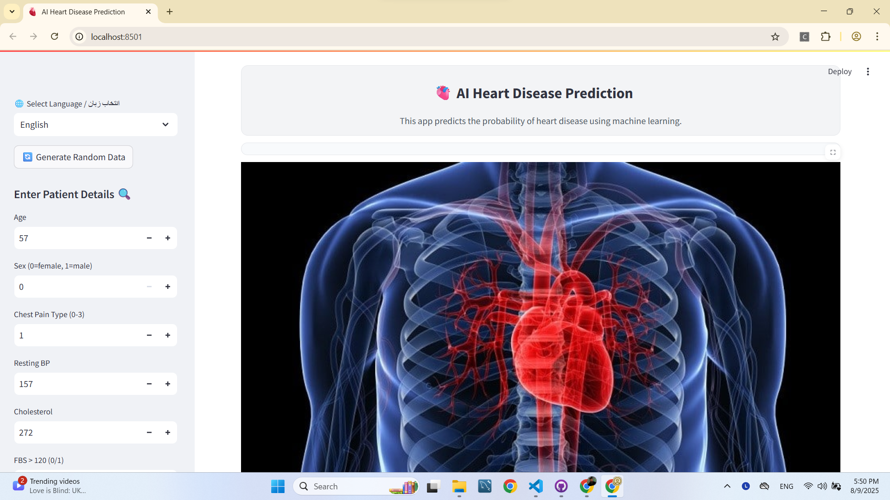
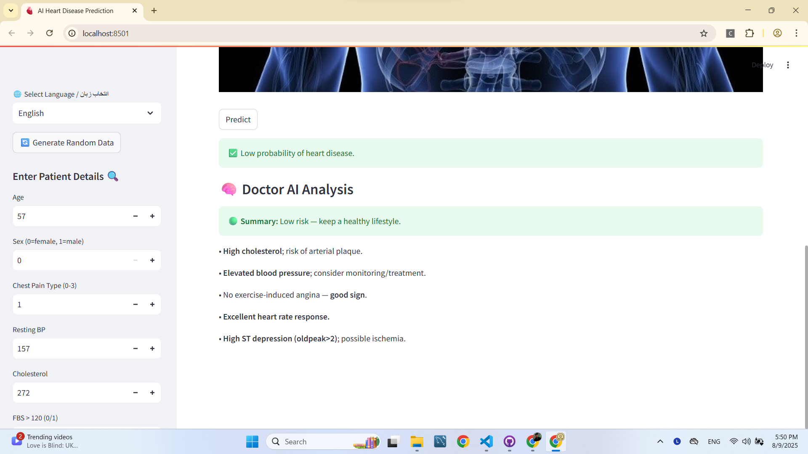
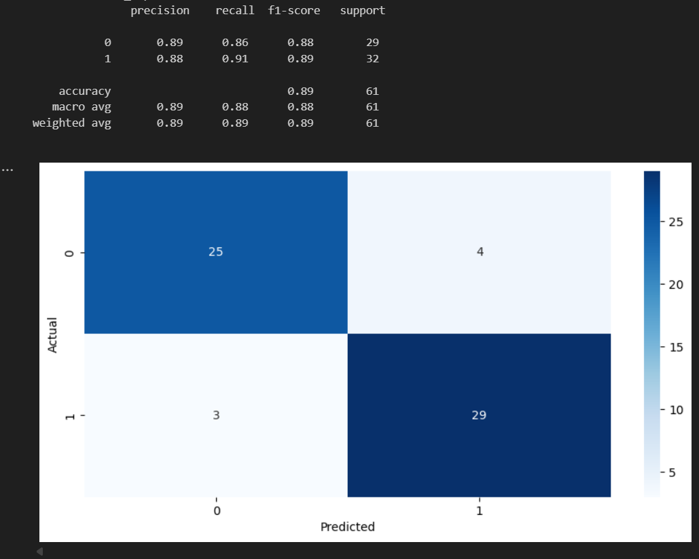

### 🫀 AI Heart Disease Prediction
## 🔗 Live Demo

You can try the app live here:  
[🌐 Click to open Heart Disease App](https://heartdisease-mehdighelich.streamlit.app/)

## 📸 Demo





📂 Project Structure
```bash
Heart_Disease/
│
├── images/                  # Project images for README & UI
│   ├── Demo1.png
│   ├── Demo2.png
│   └── heart_image.jpg
│
├── models/                  # Saved model files
│   └── catboost_model.txt
│
├── notebooks/               # Jupyter notebooks for experiments
│   ├── catboost_info/
│   ├── Final_Heart_Model.ipynb
│   ├── heart_pipeline_model.pkl
│   └── pipeline.ipynb
│
├── scale/
│   └── scaler.txt
│
├── src/                     # Source code
│   ├── data/
│   │   └── preprocess.py    # Preprocessing pipeline
│   ├── metrics/
│   │   └── evaluate.py      # Evaluation utilities
│   └── models/
│       └── train_model.py   # Model training script
│
├── app.py                   # Streamlit web application
├── main.py                  # Entry point for running training/evaluation
├── heart_pipeline_model.pkl # Saved trained pipeline
├── pipeline_heart.pkl       # Alternative saved pipeline
├── requirements.txt         # Python dependencies
└── README.md                # Project documentation


📊 Dataset Overview
We used the heart.csv dataset containing medical attributes to predict heart disease.

Features:

age – Age of the patient

sex – Gender (0=female, 1=male)

cp – Chest pain type (0–3)

trestbps – Resting blood pressure

chol – Serum cholesterol (mg/dl)

fbs – Fasting blood sugar > 120 mg/dl (0/1)

restecg – Resting ECG results (0–2)

thalach – Max heart rate achieved

exang – Exercise-induced angina (0/1)

oldpeak – ST depression induced by exercise

slope – Slope of the peak exercise ST segment

ca – Number of major vessels (0–4)

thal – Thalassemia type (0–3)

target – Presence of heart disease (1=yes, 0=no)

🚀 Project Workflow
Exploratory Data Analysis (EDA)

Analyzed dataset distributions and feature correlations.

No missing values detected.

Data Visualization

Plotted histograms and density plots for key medical indicators.

Data Preprocessing

Applied StandardScaler for scaling numerical features.

Removed noise using Local Outlier Factor (LOF).

Balanced classes using SMOTETomek.

Model Training

CatBoost Classifier as the final production model.

Evaluation Metrics

Accuracy, Recall, F1-Score, Confusion Matrix, ROC Curve.

Feature Importance

Most influential: age, thalach, chol.

Deployment

Built a Streamlit app for user-friendly predictions.

Input form for patient details.

Multi-language (Persian/English) support.

Detailed "Doctor AI" analysis based on medical thresholds.

📈 Model Performance (Final CatBoost Model)
Classification Report:



💡 How to Run Locally

# Clone repository
git clone https://github.com/yourusername/Heart_Disease.git
cd Heart_Disease

# Install dependencies
pip install -r requirements.txt

# Run the Streamlit app
streamlit run app.py
🧠 Model Used
CatBoost Classifier (Final model in production pipeline)

✨ Features of the Web App
🌐 Persian/English language switch

🖼 Medical image-based UI

📊 Doctor AI detailed analysis

🎲 Random patient data generator

📉 Probability-based risk scoring
